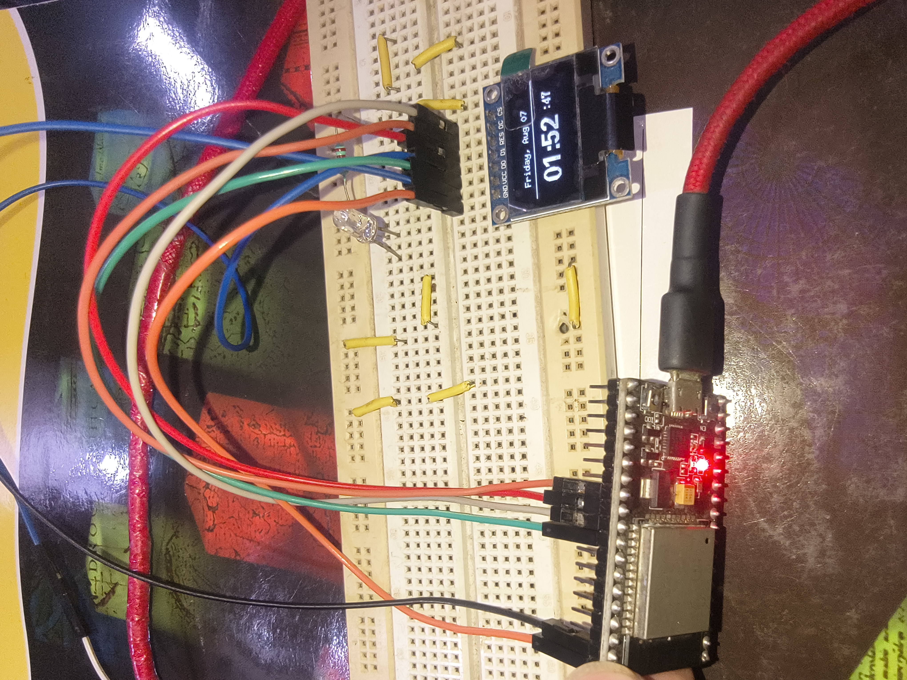

# ESP32 NTP Clock 🕐

A Wi-Fi enabled digital clock built using an **ESP32** and a **128×64 SSD1306 OLED display**.

The ESP32 connects to Wi-Fi, retrieves the current time from an NTP server, converts it to **Indian Standard Time (IST)**, and displays the date and time on the OLED.

---

## 🎯 Objective

The goal of this project was to learn how an ESP32 can:

- Connect to a Wi-Fi network
- Communicate with an internet-based time server
- Retrieve real-world time using NTP
- Process and format time data
- Display information on an OLED
- Work with the U8g2 graphics library

---

## 🧩 Components

- ESP32-WROOM
- 128×64 SSD1306 OLED display
- Jumper wires
- Wi-Fi network

---

## 📚 Concepts Used

### ESP32

- Wi-Fi connectivity
- `WiFi.begin()`
- `WiFi.status()`
- Network communication

### NTP

- Network Time Protocol
- NTP server: `pool.ntp.org`
- UTC/GMT offset
- Indian Standard Time (GMT+5:30)

### OLED

- SSD1306 128×64 OLED
- U8g2 library
- Software SPI
- Buffer-based display rendering

### Time Handling

- `configTime()`
- `getLocalTime()`
- `struct tm`
- `strftime()`

---

## 🔌 OLED Connection

The OLED is connected to the ESP32 using **4-wire software SPI**.

| OLED Signal | ESP32 GPIO |
|---|---:|
| Clock (CLK) | GPIO 18 |
| Data (MOSI) | GPIO 23 |
| Chip Select (CS) | GPIO 5 |
| Data/Command (DC) | GPIO 16 |
| Reset (RST) | GPIO 17 |

---

## 🕐 Time Configuration

The project uses **Network Time Protocol (NTP)** to obtain the current time from the internet.

```cpp
configTime(gmtOffset_sec, daylightOffset_sec, "pool.ntp.org");
```
IST configuration:
```cpp
const long gmtOffset_sec = 19800;
const int daylightOffset_sec = 0;
```
## 🔄 How It Works

```text
Wi-Fi
  ↓
NTP Server
  ↓
ESP32
  ↓
Time Processing
  ↓
SSD1306 OLED
```
The display is updated every second with the current date, hours, minutes, and seconds.

## 💻 Libraries

- `WiFi.h`
- `U8g2lib.h`
- `time.h`

---
## 📸 Output



---

## 🧠 What I Learned

- ESP32 Wi-Fi connectivity
- NTP time synchronization
- Time formatting using `strftime()`
- SSD1306 OLED interfacing
- Software SPI
- U8g2 display buffering
- Combining networking with hardware interfacing

---

## 🚀 Future Improvements

- Wi-Fi auto-reconnection
- 12/24-hour format
- Non-blocking time updates
- Weather information
- Web-based configuration

---

## 📌 Project Status

**Completed ✅**
