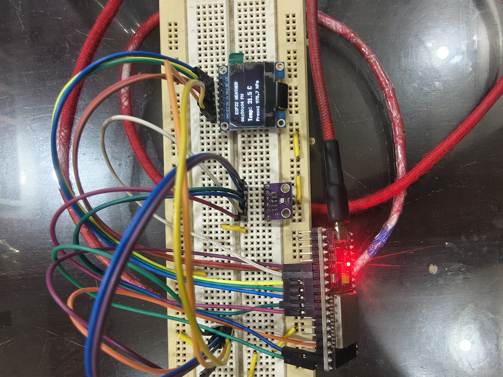

# ESP32 Temperature & Pressure Weather Station

An IoT-based environmental monitoring project built using an **ESP32**, **BMP280 sensor**, and **OLED display**.

The system continuously monitors **temperature** and **atmospheric pressure**, displays the readings locally on an OLED screen, and provides a **real-time web dashboard** that can be accessed from devices connected to the same network.

The project is being developed using a version-based approach, allowing new features to be added while keeping previous stable versions preserved.

---

# 📌 Project Overview

The ESP32 Temperature & Pressure Weather Station is designed to monitor environmental conditions in real time.

The ESP32 reads temperature and atmospheric pressure data from the BMP280 sensor. The collected data is displayed on an OLED screen and is also made available through a local web dashboard.

The web dashboard provides live sensor readings, Wi-Fi information, device uptime, sensor history graphs, and basic sensor statistics.

The project also includes Wi-Fi reconnection handling and NTP-based time synchronization.

---

# 🎯 Project Objectives

The main objectives of this project are:

- Learn how to interface environmental sensors with the ESP32.
- Understand SPI communication using the BMP280.
- Display sensor data on an OLED display.
- Learn ESP32 Wi-Fi connectivity and reconnection handling.
- Build a local web server using the ESP32.
- Create a responsive web dashboard.
- Understand communication between an ESP32 backend and a web frontend.
- Implement NTP-based time synchronization.
- Store sensor readings in memory for historical visualization.
- Visualize sensor data using graphs.
- Calculate minimum, maximum, and average sensor values.
- Develop the project using a version-based approach.

---

# ✨ Current Features

The current stable version of the project is **V1.1**.

## Sensor Monitoring

- Real-time temperature monitoring.
- Real-time atmospheric pressure monitoring.
- BMP280 sensor communication using SPI.

## OLED Display

- Displays live sensor information.
- Provides local monitoring without requiring a browser.

## Wi-Fi Connectivity

- Connects the ESP32 to a Wi-Fi network.
- Handles Wi-Fi disconnections.
- Automatically attempts reconnection.
- Continues operating even when Wi-Fi is temporarily unavailable.

## Time Synchronization

- Synchronizes time using NTP when Wi-Fi is available.
- Displays time in 12-hour format.
- Displays the current date.

## Web Dashboard

The local web dashboard provides:

- Live temperature.
- Live atmospheric pressure.
- Current time.
- Current date.
- Wi-Fi signal strength.
- Wi-Fi signal quality.
- Device uptime.
- System connection status.
- Last successful dashboard update.

## Sensor History

- Stores recent sensor readings in a circular history buffer.
- Displays temperature history using a graph.
- Displays pressure history using a graph.

## Sensor Statistics

The dashboard calculates:

- Minimum temperature.
- Maximum temperature.
- Average temperature.
- Minimum pressure.
- Maximum pressure.
- Average pressure.

## Responsive Interface

- Dashboard can be accessed from a computer.
- Dashboard can be accessed from a mobile phone.
- Layout automatically adjusts for smaller screens.

---

# 🧰 Hardware Components

| Component | Quantity | Purpose |
|---|---:|---|
| ESP32 | 1 | Main microcontroller |
| BMP280 | 1 | Temperature and atmospheric pressure sensor |
| OLED Display | 1 | Local sensor data display |
| Jumper Wires | As required | Circuit connections |
| Breadboard | 1 | Hardware prototyping |
| USB Cable / Power Supply | 1 | ESP32 programming and power |

---

# 🔌 Circuit Connections

## BMP280 to ESP32

The BMP280 is connected using the SPI communication interface.

| BMP280 Pin | ESP32 |
|---|---|
| VCC | 3.3V |
| GND | GND |
| SCK | ESP32 SPI Clock Pin 18 |
| SDO / MISO | ESP32 SPI MISO Pin 19 |
| SDA / MOSI | ESP32 SPI MOSI Pin 23 |
| CS | ESP32 Chip Select Pin 4 |

> The exact GPIO assignments are defined in the version-specific source code.

## OLED to ESP32

The OLED display is connected using the configured software SPI interface.

| OLED Pin | ESP32 |
|---|---|
| VCC | 3.3V |
| GND | GND |
| CLK | Configured Clock GPIO 14  |
| MOSI / DIN | Configured Data GPIO 13 |
| CS | Configured Chip Select GPIO 5 |
| DC | Configured Data/Command GPIO 16 |
| RST | Configured Reset GPIO 17 |

> Refer to the version-specific source code for the exact GPIO pin assignments.

---

# 🏗️ System Architecture

```text
                 ┌───────────────┐
                 │    BMP280     │
                 │ Temperature   │
                 │   Pressure    │
                 └───────┬───────┘
                         │
                         │ SPI
                         ▼
                  ┌──────────────┐
                  │    ESP32     │
                  │              │
                  │ Sensor Logic │
                  │ Wi-Fi        │
                  │ NTP Time     │
                  │ Web Server   │
                  │ History      │
                  └───────┬──────┘
                          │
            ┌─────────────┼─────────────┐
            │             │             │
            ▼             ▼             ▼
      ┌──────────┐  ┌──────────┐  ┌─────────────┐
      │   OLED   │  │  Wi-Fi   │  │ Web Browser │
      │ Display  │  │ Network  │  │  Dashboard  │
      └──────────┘  └──────────┘  └─────────────┘
```

---

# ⚙️ Software and Libraries

The project is developed using the Arduino IDE and ESP32 development framework.

## Main Libraries

- `WiFi.h`
- `WebServer.h`
- `SPI.h`
- `Adafruit_BMP280.h`
- `Adafruit_GFX.h`
- `Adafruit_SSD1306.h`
- `time.h`

## Web Technologies

The ESP32 web dashboard uses:

- HTML
- CSS
- JavaScript
- Chart.js for sensor history visualization

---

# 🔄 Working Principle

The overall system operation is:

```text
Power ON
   │
   ▼
Initialize ESP32
   │
   ├── Initialize SPI
   │
   ├── Initialize OLED
   │
   ├── Initialize BMP280
   │
   └── Connect to Wi-Fi
            │
            ▼
      Synchronize NTP Time
            │
            ▼
      Start Web Server
            │
            ▼
Read Sensor Data
   │
   ├── Temperature
   │
   └── Atmospheric Pressure
            │
            ▼
Update OLED Display
            │
            ▼
Store Sensor Reading
            │
            ▼
Provide Data to Web Dashboard
            │
            ▼
Repeat
```

---

# 🌐 Web Dashboard

The ESP32 hosts a local web server that provides a real-time monitoring dashboard.

The dashboard communicates with the ESP32 through API endpoints.

The dashboard provides:

- Live temperature
- Live atmospheric pressure
- Current time
- Current date
- Wi-Fi signal strength
- Wi-Fi signal quality
- Device uptime
- System connection status
- Last successful dashboard update
- Temperature history graph
- Pressure history graph
- Sensor statistics

The dashboard is responsive and can be accessed from both desktop and mobile devices connected to the same network.

---

# 🔌 API Endpoints

## Current Sensor Data

```text
/api/data
```

This endpoint provides the current system information.

Example response:

```json
{
  "temperature": 30.27,
  "pressure": 978.91,
  "time": "12:30:35 AM",
  "date": "26/08/2026",
  "wifi": "Connected",
  "wifiSignal": -63,
  "uptime": 177
}
```

## Sensor History

```text
/api/history
```

This endpoint provides stored sensor history data.

The data is used for:

- Temperature history graph
- Pressure history graph
- Minimum value calculation
- Maximum value calculation
- Average value calculation

---

# 📊 Sensor History System

The ESP32 stores recent sensor readings in a circular history buffer.

Each stored reading contains:

```text
Temperature
Pressure
Time
```

The stored data is then provided to the web dashboard through the history API.

```text
Sensor Reading
      │
      ▼
Store in History Buffer
      │
      ▼
Circular Buffer Management
      │
      ▼
/api/history
      │
      ▼
Web Dashboard
      │
      ├── Temperature Graph
      │
      ├── Pressure Graph
      │
      └── Statistics
```

The current history system stores data in RAM.

Therefore, the stored history is cleared when the ESP32 restarts.

Persistent data storage may be added in future versions.

---

# 📈 Sensor Statistics

The web dashboard calculates statistics using the stored sensor history.

## Temperature Statistics

- Minimum Temperature
- Maximum Temperature
- Average Temperature

## Pressure Statistics

- Minimum Pressure
- Maximum Pressure
- Average Pressure

The statistics are automatically recalculated whenever updated history data is received by the dashboard.

---

# 📶 Wi-Fi Connection and Reconnection

During startup, the ESP32 attempts to connect to the configured Wi-Fi network.

If the initial connection is unsuccessful:

- Sensor monitoring continues.
- The OLED continues displaying sensor data.
- The system keeps attempting to reconnect to Wi-Fi.
- Network-based features become available once the connection is restored.

When Wi-Fi connectivity is restored:

```text
Wi-Fi Connected
      │
      ▼
Synchronize Time
      │
      ▼
Resume Network Features
```

This allows the weather station to continue performing its core monitoring function even when Wi-Fi connectivity is temporarily unavailable.

---

# 🕒 NTP Time Synchronization

The ESP32 synchronizes its time using NTP when a Wi-Fi connection is available.

The synchronized time is used for:

- Dashboard time display
- Date display
- Timestamping sensor history readings

The project displays time in a 12-hour format.

If the system has not yet received a valid time, it may temporarily display:

```text
--:--:--
```

until synchronization is completed.

---

# 🖥️ OLED Display

The OLED display provides local access to sensor information without requiring a web browser.

The display is initialized during system startup and is used to show the weather station's current sensor data.

This allows the device to continue providing useful environmental information even without accessing the web dashboard.

---

# 📁 Project Structure

```text
03-esp-temp-pressure-station/
│
├── README.md
│
├── V_1.0/
│   ├── V_1.0.ino
│   └── README.md
│
├── V_1.1/
│   ├── V_1.1.ino
│   ├── README.md
│   │
│   └── images/
│       ├── hardware/
│       ├── oled/
│       └── dashboard/
│
└── V_1.2/
    └── Future development
```

The root-level `README.md` contains the common documentation for the complete project.

Each version folder can contain:

- Version-specific source code
- Version-specific changes
- Screenshots and images
- Version-specific documentation

---

# 🧪 Current Stable Version

## Version 1.1

**V1.1 is the current stable and tested version of the project.**

Key features and improvements include:

- Improved Wi-Fi reconnection handling
- NTP time synchronization
- 12-hour time display
- Date display
- Local web dashboard
- Wi-Fi signal monitoring
- Wi-Fi signal quality display
- Device uptime monitoring
- System connection status
- Temperature history graph
- Pressure history graph
- Minimum, maximum, and average sensor statistics
- Circular sensor history buffer
- Responsive dashboard design
- Clean separation of HTML, CSS, and JavaScript

All major features were tested after implementation.

---

# 🗺️ Version History

## V1.0

Initial version of the ESP32 temperature and pressure monitoring system.

The primary focus was:

- ESP32 setup
- BMP280 sensor interfacing
- Temperature monitoring
- Atmospheric pressure monitoring
- OLED display integration

## V1.1

Expanded the project into a more complete IoT monitoring system.

```text
Sensors
   +
Wi-Fi
   +
NTP Time
   +
Web Dashboard
   +
Sensor History
   +
Graphs
   +
Statistics
```

Major additions:

- Local web dashboard
- Wi-Fi monitoring
- Automatic Wi-Fi reconnection
- NTP time synchronization
- Sensor history system
- Temperature graph
- Pressure graph
- Sensor statistics
- Responsive user interface

---

# 🚀 Future Development

## V1.2 - Planned Features

The next version may include:

- Pressure trend detection
- Temperature trend detection
- Weather condition indicator
- Dashboard alert system
- Automatic OLED screen rotation

Future development will be built on the stable V1.1 version.

---

# 🔮 Future Improvements

Possible future improvements include:

- Persistent sensor history using LittleFS
- Data logging
- SD card support
- Remote cloud monitoring
- MQTT integration
- Mobile application integration
- Configurable alert thresholds
- Historical data export
- Additional environmental sensors
- OTA firmware updates
- Multi-sensor monitoring

---


## 📸 Hardware Setup



# 🎓 Learning Outcomes

This project provided practical experience with:

- ESP32 programming
- Embedded C/C++ programming
- SPI communication
- BMP280 sensor interfacing
- OLED interfacing
- Wi-Fi connectivity
- Wi-Fi reconnection handling
- ESP32 web servers
- API communication between ESP32 and web frontend
- NTP time synchronization
- HTML integration with embedded systems
- CSS for responsive dashboards
- JavaScript for live data updates
- Real-time data visualization
- Chart-based sensor history
- Circular data buffers
- Sensor data processing
- Embedded system debugging
- Version-based project development

---

# 👨‍💻 Author

**Harsh Jain**

Student | Embedded Systems and IoT Enthusiast

---

# ⭐ Project Status

🟢 **Current Stable Version: V1.1**

The project is actively being developed, with additional features planned for future versions.

---

If you found this project interesting, feel free to explore the source code and follow the project's development journey.
